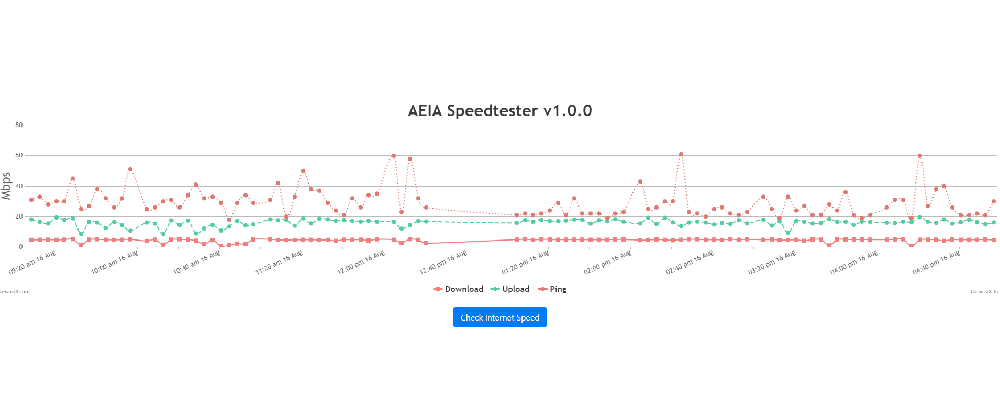

# AEIA Speedtester
A simple app for monitoring internet speed test results.



## Running
You can run the app's server with node:
```bash
$ node server.js
```

or with docker:
```bash
$ docker-compose up
```

## Developing

Install nvm:

```
$ curl -o- https://raw.githubusercontent.com/nvm-sh/nvm/v0.39.1/install.sh | bash
```

```
$ nvm install 12
```

*Note: Install node v12+*

### Tech Stack
Here are the list of packages/tech used in this project.
- NodeJS
- speed-test
- node-cron
- nodemon
- express
- CanvasJs

